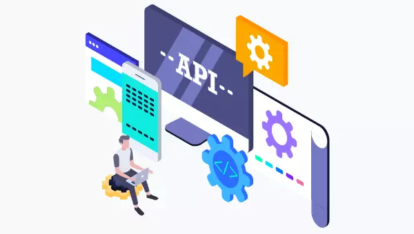

# Comparaison des types d'API

## Introduction

Dans le cadre de notre projet utilisant NestJS avec TypeScript et TypeORM pour interagir avec une base de données PostgreSQL, nous devons choisir le type d'API qui convient le mieux à nos besoins. Dans ce document, nous allons comparer les trois principaux types d'API : RESTful API, GraphQL API et gRPC API, en tenant compte des distinctions entre les API stateless et stateful, et justifier notre choix final.

## Types d'API

### 1. RESTful API (API REST)

#### Description :

Une API REST est basée sur le modèle architectural REST (Representational State Transfer). Elle utilise les méthodes HTTP standard (GET, POST, PUT, DELETE) pour effectuer des opérations CRUD (Create, Read, Update, Delete) sur des ressources.

#### Distinction stateless :

Les API REST stateless ne stockent pas l'état de la session côté serveur entre les requêtes. Chaque requête client contient toutes les informations nécessaires pour être traitée de manière autonome par le serveur, sans dépendre de requêtes précédentes.

#### Distinction stateful :

Les API REST stateful stockent l'état de la session côté serveur entre les requêtes. Cela signifie que le serveur garde une trace de l'état de chaque session client et peut répondre en fonction de cet état.

#### Avantages des API REST Stateless :

- Facilité de mise en cache, évolutivité simplifiée, robustesse et tolérance aux pannes.
- Moins de complexité pour gérer l'état côté serveur.

#### Avantages des API REST Stateful :

- Peut simplifier certaines interactions client-serveur en maintenant un contexte d'état cohérent entre les requêtes.

### 2. GraphQL API

#### Description :

Une API GraphQL permet aux clients de spécifier exactement les données dont ils ont besoin. Elle utilise un seul endpoint pour toutes les requêtes, et les clients demandent uniquement les champs spécifiques dont ils ont besoin pour chaque requête.

### 3. gRPC API

#### Description :

gRPC est un framework RPC (Remote Procedure Call) open source développé par Google. Il utilise le protocole HTTP/2 pour le transport et le protocole de sérialisation de messages protobuf.

## Comparaison

| Critère                   | RESTful API     | GraphQL API     | gRPC API        |
| ------------------------- | --------------- | --------------- | --------------- |
| Facilité d'utilisation    | ✅              | ⭐️⭐️⭐️⭐️⭐️ | ⭐️⭐️⭐️       |
| Performance               | ⭐️⭐️⭐️⭐️⭐️ | ⭐️⭐️⭐️       | ⭐️⭐️⭐️⭐️⭐️ |
| Flexibilité               | ⭐️⭐️⭐️       | ✅              | ⭐️⭐️⭐️⭐️    |
| Courbe d'apprentissage    | ✅              | ⭐️⭐️⭐️       | ⭐️⭐️⭐️       |
| Évolutivité               | ✅              | ✅              | ⭐️⭐️⭐️       |
| Outils et support         | ✅              | ⭐️⭐️⭐️       | ⭐️⭐️⭐️       |
| Adoption dans l'industrie | ⭐️⭐️⭐️       | ⭐️⭐️⭐️       | ⭐️⭐️          |

Légende

- ✅ : Avantage significatif
- ⭐️⭐️⭐️⭐️⭐️ : Très bon
- ⭐️⭐️⭐️ : Bon
- ⭐️⭐️ : Moyen

## Choix de l'API

Pour notre projet, nous recommandons l'utilisation d'une API RESTful stateless. Cette recommandation est basée sur les facteurs suivants :

- Facilité d'utilisation : Les API RESTful sont largement connues et utilisées, ce qui rend leur adoption et leur compréhension faciles pour les développeurs.
- Performance : Les API RESTful offrent des performances élevées et sont bien adaptées aux opérations CRUD sur des ressources.
- Évolutivité : Les API RESTful stateless sont particulièrement évolutives grâce à leur nature sans état, ce qui les rend faciles à mettre en cache et à scaler horizontalement.
- Moins de complexité : Les API RESTful stateless sont généralement moins complexes à mettre en œuvre et à maintenir que les API RESTful stateful.

En conclusion, une API RESTful stateless répondra le mieux à nos besoins en matière de simplicité, de performance et de facilité de mise en œuvre pour notre projet.
