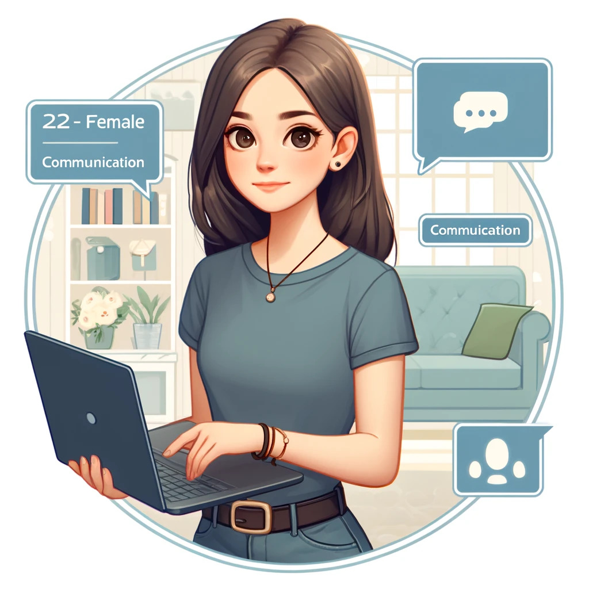

# Les personas

Ces personas vont nous guider lors de l'élaboration des user stories en mettant l'accent sur les besoins, objectifs et défis spécifiques de chaque type d'utilisateur.

> **Persona 1** : Responsable(s) de la plateforme/administrateur(s)
>
> - **Âge** : Moyenne 30 ans
> - **Profession** :
>   > Concepteur développeur d’applications
> - **Expérience technologique** :
>   > Possède une expérience dans le développement d'applications web et mobiles, avec une connaissance des langages de programmation modernes, des frameworks, et des outils de collaboration en ligne. Il a également une bonne maîtrise des pratiques de veille technologique et de gestion de projet agile.
> - **Objectifs** :
>   > Créer une plateforme collaborative qui centralise les informations sur les technologies web et les langages de programmation de manière accessible et organisée. Orientée veille techno (active et passive)Favoriser un environnement d'apprentissage et de partage pour les développeurs de niveau débutant à développeurs juniors.
> - **Besoins** :
>   > Outils de gestion de contenu flexibles et efficaces pour organiser, filtrer et présenter les informations et les ressources de manière intuitive. Mécanismes de feedback et d’interaction communautaire pour encourager la participation des utilisateurs et le partage de connaissances.
> - **Défis** :
>   > Assurer l'actualité et la pertinence des contenus partagés sur la plateforme tout en gardant le site accessible aux débutants. Encourager une communauté vivante et participative, même si les utilisateurs ont des compétences et des centres d'intérêt très différents. Trouver un équilibre entre le temps et les moyens à consacrer pour améliorer le site et le besoin de rester à jour avec les nouvelles technologies dans son métier.

---

> **Persona 2** : Alexandra, la Néophyte
>
> - **Âge** : 22 ans
> - **Profession** :
>   > Étudiante en communication
> - **Expérience technologique** :
>   > Faible à modérée. Utilise principalement des applications pour les réseaux sociaux, le courrier électronique et la rédaction de documents. Connaissances de base en HTML acquises lors d'un cours en ligne.
> - **Objectifs** :
>   > Explorer les technologies web et les langages de programmation pour élargir ses horizons et éventuellement intégrer des compétences en développement web dans son parcours professionnel. Comprendre les concepts de base des technologies web sans se plonger dans les détails techniques.
> - **Besoins** :
>   > Des articles introductifs et des tutoriels faciles à comprendre sur diverses technologies et langages web. Une communauté accueillante pour poser des questions de débutant et obtenir des réponses sans jugement.
> - **Défis** :
>   > Ne pas se sentir dépassée par la complexité technique et le jargon. Trouver un point de départ pour son apprentissage.

---

> **Persona 3** : Sam, le Développeur Junior
>
> - **Âge** : 27 ans
> - **Profession** :
>   > Développeur web junior dans une petite entreprise
> - **Expérience technologique** :
>   > Bonne. Maîtrise les bases du HTML, CSS et JavaScript. A déjà travaillé sur quelques projets web simples.
> - **Objectifs** :
>   > Améliorer ses compétences en développement web en apprenant de nouvelles technologies et langages. Rester à jour avec les dernières tendances technologiques pour être plus compétitif sur le marché du travail.
> - **Besoins** :
>   > Accéder à des articles de veille technologique pour découvrir de nouvelles technologies et meilleures pratiques. Collaborer et échanger avec d'autres développeurs pour résoudre des problèmes et partager des connaissances.
> - **Défis** :
>   > Manque de temps pour la recherche et l'apprentissage autonome en raison des exigences de son emploi. Difficulté à filtrer les informations pertinentes et fiables parmi la surabondance de contenus disponibles en ligne.

---

> **Persona 4**
> : Olivier, le Modérateur
>
> - **Âge** : 38 ans
> - **Profession** :
>   > Analyste qualité dans une entreprise de développement logiciel
> - **Expérience technologique** :
>   > Solide expérience dans l'analyse des logiciels et des processus de développement. Connaît les principes de base des langages de programmation et des technologies web.
> - **Objectifs** :
>   > Assurer la qualité et la pertinence du contenu sur la plateforme en supervisant les contributions des utilisateurs. Veiller à ce que les discussions restent constructives et respectueuses au sein de la communauté.
> - **Besoins** :
>   > Outils de modération efficaces pour surveiller les activités des utilisateurs et intervenir en cas de besoin. Formation continue sur les meilleures pratiques de modération et sur l'évolution des menaces en ligne.
> - **Défis** :
>   > Trouver un équilibre entre la liberté d'expression des utilisateurs et la nécessité de maintenir un environnement sûr et accueillant. Gérer les conflits et les comportements inappropriés tout en maintenant la confiance et l'engagement de la communauté.

---

> **Persona 5** : Emily, la Super Administratrice
>
> - **Âge** : 45 ans
> - **Profession** :
>   > Directrice technique d'une entreprise de développement de logiciels
> - **Expérience technologique** :
>   > Expertise approfondie en sécurité informatique, administration de systèmes et interfaces de ligne de commande. Excellente connaissance des protocoles d’authentification et de gestion des droits d’accès.
>   > Familiarité avec les environnements Unix/Linux et les scripts shell pour l’automatisation et la gestion des systèmes.
> - **Objectifs** :
>   > Maintenir la sécurité et l’intégrité des comptes administratifs. Assurer que les administrateurs disposent des droits adéquats pour leurs fonctions sans compromettre la sécurité du système.
> - **Besoins** :
>   > Outils de ligne de commande sécurisés et efficaces pour la gestion des comptes administrateurs, permettant de créer, modifier et désactiver des comptes facilement.
> - **Défis** :
>   > Garantir une gestion sécurisée et précise des comptes administrateurs. Cela requiert une attention méticuleuse et des contrôles d’accès rigoureux pour prévenir les intrusions.
>   > Maîtriser pleinement l’utilisation des interfaces de ligne de commande, qui sont essentielles pour toutes ces opérations.

[🔙 Retour à la Table des matières principale](../../../README.md)
