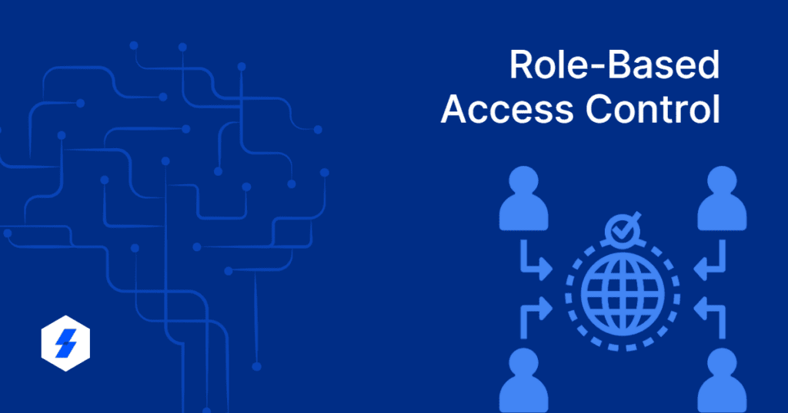

Ce tableau aligne les permissions et les actions possibles pour chaque rôle selon les exigences et les scénarios d'utilisation détaillés dans nos User Stories. Il est conçu pour faciliter la compréhension des responsabilités et des capacités de chaque rôle au sein de la plateforme, assurant ainsi que les objectifs de gestion des utilisateurs, de modération des contenus et d'engagement des utilisateurs sont atteints efficacement.

### Vue d'ensemble :

| Autorisations / Rôle                                          | Visiteur | Utilisateur | Modérateur | Administrateur | Super Administrateur |
| ------------------------------------------------------------- | -------- | ----------- | ---------- | -------------- | -------------------- |
| Gestion de l'authentification et accès à contenu personnalisé | ✅       | ✅          | ✅         | ✅             | ❌                   |
| Recevoir des notifications en cas de suppression de contenu   | ❌       | ✅          | ✅         | ✅             | ❌                   |
| Publication d'articles et de commentaires                     | ❌       | ✅          | ✅         | ✅             | ❌                   |
| Accès à une interface de modération                           | ❌       | ❌          | ✅         | ✅             | ❌                   |
| Suppression de contenus non conformes                         | ❌       | ❌          | ✅         | ✅             | ❌                   |
| Accorder ou retirer des permissions de publication            | ❌       | ❌          | ✅         | ✅             | ❌                   |
| Accès à un rapport d'activité de modération                   | ❌       | ❌          | ✅         | ✅             | ❌                   |
| Créer des comptes modérateurs                                 | ❌       | ❌          | ❌         | ✅             | ❌                   |
| Modifier des comptes modérateurs                              | ❌       | ❌          | ❌         | ✅             | ❌                   |
| Supprimer des comptes modérateurs                             | ❌       | ❌          | ❌         | ✅             | ❌                   |
| Créer des comptes utilisateurs                                | ❌       | ❌          | ❌         | ✅             | ❌                   |
| Modifier des comptes utilisateurs                             | ❌       | ❌          | ❌         | ✅             | ❌                   |
| Supprimer des comptes utilisateurs                            | ❌       | ❌          | ❌         | ✅             | ❌                   |
| Attribuer/modifier des rôles                                  | ❌       | ❌          | ❌         | ✅             | ❌                   |
| Créer des administrateurs                                     | ❌       | ❌          | ❌         | ❌             | ✅                   |
| Modifier des administrateurs                                  | ❌       | ❌          | ❌         | ❌             | ✅                   |
| Supprimer des administrateurs                                 | ❌       | ❌          | ❌         | ❌             | ✅                   |

### Vue détaillée :

Cliquez pour voir les autorisations détaillées de chaque rôle (Cliquez pour développer)

| Autorisations / Rôle                                          | Visiteur                | Utilisateur                                                 | Modérateur                                                  | Administrateur                                                     | Super Administrateur                                   |
| ------------------------------------------------------------- | ----------------------- | ----------------------------------------------------------- | ----------------------------------------------------------- | ------------------------------------------------------------------ | ------------------------------------------------------ |
| Gestion de l'authentification et accès à contenu personnalisé | Créer son propre compte | Créer, modifier, supprimer son propre compte                | Modifier son propre compte                                  | Créer, modifier, supprimer des comptes utilisateurs et modérateurs | Créer, modifier, supprimer des comptes administrateurs |
| Recevoir des notifications en cas de suppression de contenu   |                         | Recevoir des notifications en cas de suppression de contenu | Recevoir des notifications en cas de suppression de contenu | Recevoir des notifications en cas de suppression de contenu        |                                                        |
| Publication d'articles et de commentaires                     |                         | Publier des articles et des commentaires                    | Publier des articles et des commentaires                    | Publier des articles et des commentaires                           |                                                        |
| Accès à une interface de modération                           |                         |                                                             | Accéder à l'interface de modération                         |                                                                    |                                                        |
| Suppression de contenus non conformes                         |                         |                                                             | Supprimer des contenus non conformes                        | Supprimer des contenus non conformes                               |                                                        |
| Accorder ou retirer des permissions de publication            |                         |                                                             | Accorder ou retirer des permissions de publication          | Accorder ou retirer des permissions de publication                 |                                                        |
| Accès à un rapport d'activité de modération                   |                         |                                                             | Accéder à un rapport d'activité de modération               | Accéder à un rapport d'activité de modération                      |                                                        |
| Créer un compte modérateur                                    |                         |                                                             |                                                             | Créer des comptes modérateurs                                      |                                                        |
| Modifier un compte modérateur                                 |                         |                                                             |                                                             | Modifier des comptes modérateurs                                   |                                                        |
| Supprimer un compte modérateur                                |                         |                                                             |                                                             | Supprimer des comptes modérateurs                                  |                                                        |
| Créer un compte utilisateur                                   |                         |                                                             |                                                             | Créer des comptes utilisateurs                                     |                                                        |
| Modifier son propre compte utilisateur                        |                         | Modifier son propre compte utilisateur                      |                                                             | Modifier des comptes utilisateurs                                  |                                                        |
| Modifier un compte utilisateur par un administrateur          |                         |                                                             |                                                             | Modifier des comptes utilisateurs par un administrateur            |                                                        |
| Supprimer un compte utilisateur                               |                         |                                                             |                                                             | Supprimer des comptes utilisateurs                                 |                                                        |
| Consulter un contenu                                          | Consulter du contenu    | Consulter du contenu                                        | Consulter du contenu                                        | Consulter du contenu                                               |                                                        |
| Commenter un contenu                                          |                         | Commenter du contenu                                        | Commenter du contenu                                        | Commenter du contenu                                               |                                                        |
| Modifier un contenu                                           |                         |                                                             |                                                             | Modifier du contenu                                                |                                                        |
| Modérer un contenu                                            |                         |                                                             | Modérer du contenu                                          | Modérer du contenu                                                 |                                                        |
| Signaler un contenu                                           |                         |                                                             |                                                             | Signaler du contenu                                                |                                                        |
| Bloquer un compte                                             |                         |                                                             |                                                             | Bloquer un compte                                                  |                                                        |
| Attribuer/modifier des rôles                                  |                         |                                                             |                                                             | Attribuer/modifier des rôles                                       |                                                        |
| Créer un administrateur                                       |                         |                                                             |                                                             | Créer des comptes administrateurs                                  | Créer, modifier, supprimer des comptes administrateurs |
| Modifier un administrateur                                    |                         |                                                             |                                                             | Modifier des comptes administrateurs                               | Créer, modifier, supprimer des comptes administrateurs |
| Supprimer un administrateur                                   |                         |                                                             |                                                             | Supprimer des comptes administrateurs                              | Créer, modifier, supprimer des comptes administrateurs |

