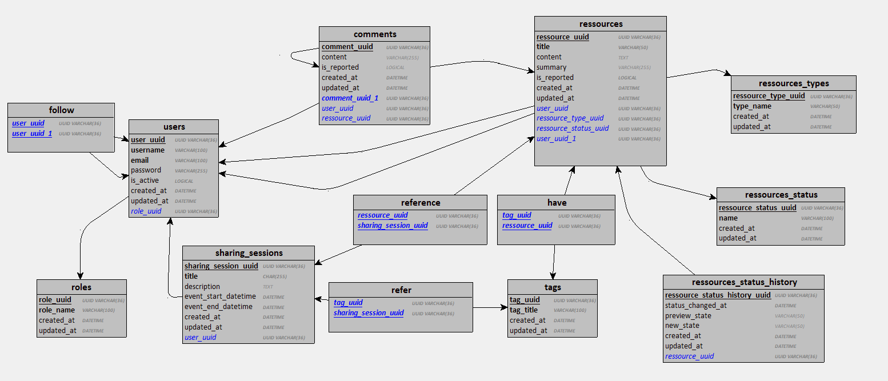

# MLD

---

Le modèle logique de données (MLD) ci-dessous détaille la structure des données de notre application, en précisant les tables, les colonnes, les types de données et les relations entre les tables, telles que dérivées du modèle conceptuel de données (MCD).

[🔙 Retour à la Table des matières](../../Spécifications-techniques/Merise/README.md)
